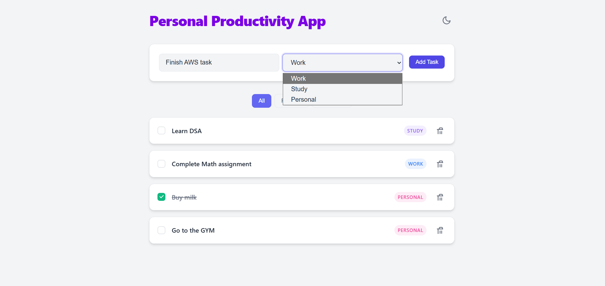
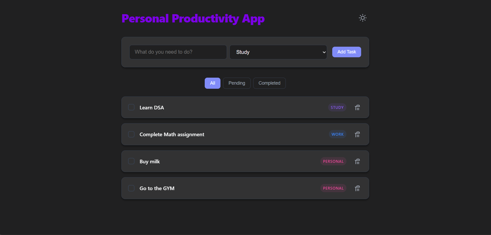
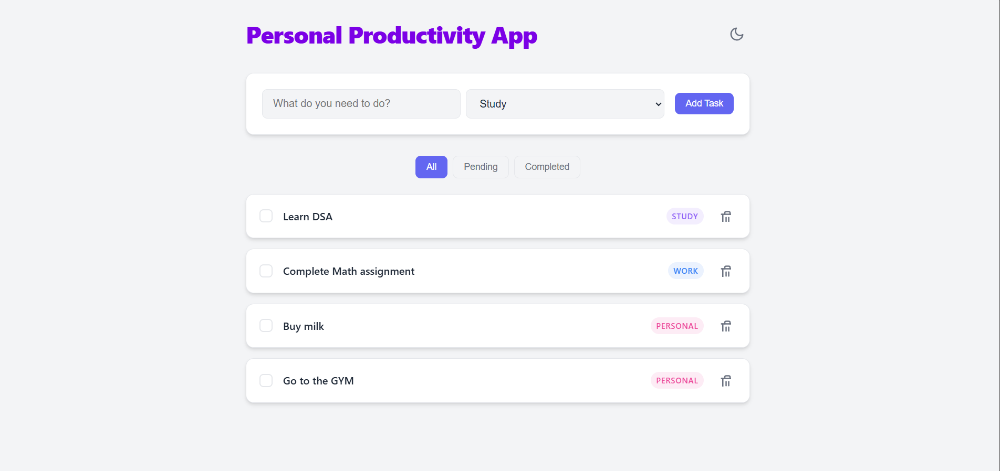
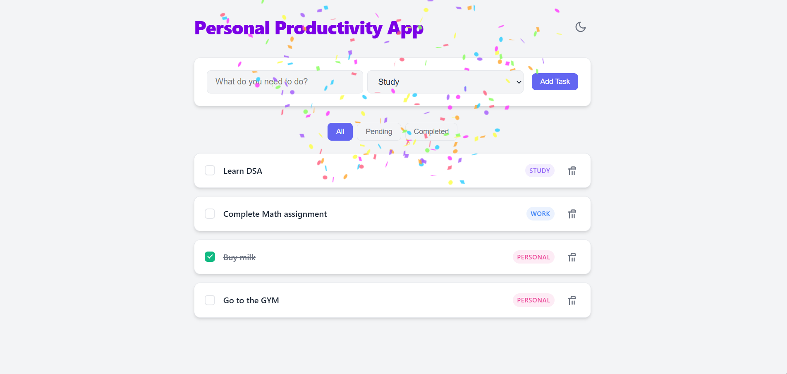

# Task Productivity Web App

A modern, responsive, and feature-rich personal productivity application designed to help you manage your tasks with ease and style.

## ✨ Features

- **✅ Task Management**: Effortlessly add, complete, and delete tasks.
- **🏷️ Categorization**: Organize your workflow with categories like **Work**, **Study**, and **Personal**.
- **🔍 Smart Filtering**: Quickly switch between **All**, **Pending**, and **Completed** tasks.
- **🌓 Dark/Light Mode**: Sleek dark mode and vibrant light mode support with automatic system preference detection.
- **💾 Persistent Storage**: Your tasks and theme preferences are automatically saved to `LocalStorage`, so they persist across sessions.
- **🎊 Interactive UI**: Smooth micro-animations, glassmorphism design elements, and celebratory confetti upon task completion!
- **📱 Responsive Design**: Fully optimized for mobile, tablet, and desktop screens.

## 🛠️ Tech Stack

- **Core**: [React 18](https://reactjs.org/)
- **Build Tool**: [Vite](https://vitejs.dev/)
- **Styling**: Vanilla CSS with a focus on CSS Variables and Glassmorphism.
- **Animations**: [Canvas Confetti](https://www.npmjs.com/package/canvas-confetti) and CSS Keyframe animations.

## 🚀 Getting Started

### Prerequisites

- [Node.js](https://nodejs.org/) (v16.0.0 or higher)
- npm or yarn

### Installation

1. Clone the repository:
   ```bash
   git clone <repository-url>
   ```
2. Navigate to the project directory:
   ```bash
   cd task-app
   ```
3. Install dependencies:
   ```bash
   npm install
   ```

### Running the App

Start the development server:
```bash
npm run dev
```
Open [http://localhost:5173](http://localhost:5173) in your browser to view the app.


## Screenshots

## 1. Add your tasks easily


## 2. Dark Mode & Light mode toggle


## 3. All tasks are stored in the localStorage of your browser


## 4. Get confetti animation on completing your tasks

